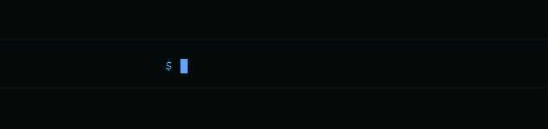

  

  
  

---

<h2>Tech Stack</h2>

<table align="center">
  <tr>
    <td align="center" width="96">
      
       Git
    </td>
    <td align="center" width="96">
      
       GitHub
    </td>
    <td align="center" width="96">
      
       Gerrit
    </td>
    <td align="center" width="96">
      
       Python
    </td>
    <td align="center" width="96">
      
       TypeScript
    </td>
    <td align="center" width="96">
      
       Java
    </td>
    <td align="center" width="96">
      
       C++
    </td>
    <td align="center" width="96">
      
       PyTorch
    </td>
    <td align="center" width="96">
      
       MATLAB
    </td>
  </tr>
</table>

---

<h3>My Contributions</h3>

<picture>
  <source media="(prefers-color-scheme: dark)" srcset="https://raw.githubusercontent.com/f-pieri/f-pieri/output/github-contribution-grid-snake-dark.svg">
  <source media="(prefers-color-scheme: light)" srcset="https://raw.githubusercontent.com/f-pieri/f-pieri/output/github-contribution-grid-snake.svg">
  
</picture>

---

  

  

